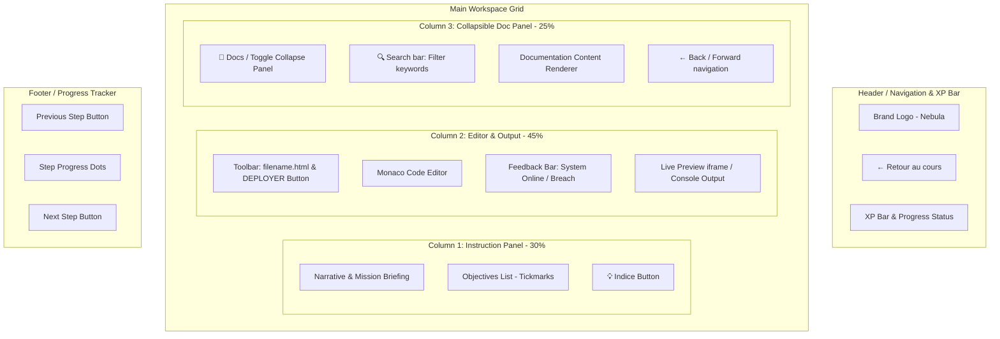
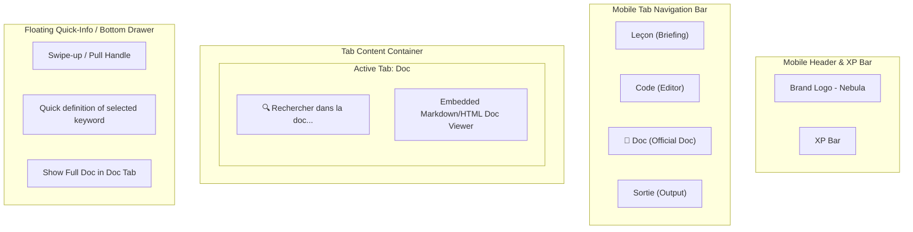
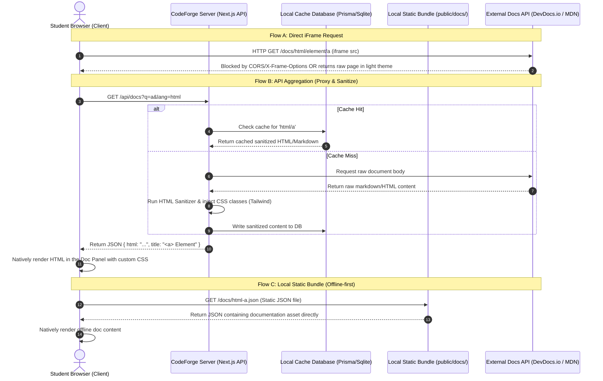

# Analysis Report: Official Documentation Integration

## Executive Summary
This report presents the UX/UI layout designs and technical architecture for integrating official documentation (HTML/CSS/JS reference) directly into the student workspace beside the Monaco code editor. We recommend a collapsible 3-column desktop layout, a tabbed/contextual mobile layout, and an offline-first Local Caching/Bundling architecture to maximize performance, reliability, and pedagogical efficiency in classroom environments.

---

## 1. UX/UI Layouts & Pedagogical Integration

### Layout 1: Desktop Collapsible 3-Column Panel
For desktop screens, the workspace will transition from a 2-column grid to an adjustable 3-column layout. The new column houses a collapsible documentation panel on the far right.

#### Component Layout Diagram

#### Key Desktop UX Interactions:
1. **Collapsibility**: The Doc Panel can be collapsed/expanded via a vertical tab button (`📖 Docs`). When collapsed, the Monaco Editor/Output pane automatically resizes to occupy 70% of the screen width, maximizing editing space.
2. **Context-Aware Triggering**: Clicking a code-related element or keyword (e.g., `<meta>` or `Array.prototype.map`) inside Monaco can show a small quick-info tooltip with a link to "Open in Docs". Clicking this link automatically expands the Doc Panel and scrolls to the relevant entry.
3. **Resizability**: Resizing handles are placed between Column 2 and Column 3, allowing students to set custom widths based on their screen size (e.g., 1080p vs. 1440p).

---

### Layout 2: Mobile Workspace (4-Tab Layout with Split Drawer)
On mobile screens, screen space is extremely limited. We avoid side-by-side splitting to prevent rendering the code editor unusable. Instead, we introduce a dedicated "Doc" tab and a contextual "Quick-Peek" bottom drawer.

#### Component Layout Diagram

#### Key Mobile UX Interactions:
1. **Dedicated Tab**: The mobile navigation bar is extended to include a "Doc" tab, sitting between "Code" and "Sortie".
2. **Bottom Swipe-up Drawer**: When the student is on the "Code" tab, selecting a keyword reveals a small floating drawer handle at the bottom. Swiping it up displays a minimal 1-2 sentence definition of the tag/method.
3. **"Open Full Doc" Link**: Within the bottom drawer, an action button ("En savoir plus") automatically redirects the student to the "Doc" tab, preloaded with that specific entry.

---

### Pedagogical Integration & Cognitive Load Analysis

Integrating documentation inside the workspace is not just a UI change, but a pedagogical choice that aligns with modern learning theories:

#### 1. Fostering Student Autonomy
* **Real-world Skill Development**: Professional developers spend a significant portion of their time reading documentation. By providing access to official references within their learning workspace, we train students to decipher official specifications rather than relying on custom-written simplified instructions.
* **Scaffolding**: By embedding documentation alongside code, we provide a structured learning scaffold. The student does not search the open web where they might copy-paste solutions without understanding them; instead, they consult references to construct their own solution.

#### 2. Minimizing Cognitive Overload (Split-Attention Effect)
* **Visual Contiguity**: The *Split-Attention Effect* occurs when learners are forced to mentally integrate disparate sources of information that are physically separated (e.g., switching between CodeForge in a browser tab and MDN in another tab). By keeping documentation on the same screen (beside the code editor), the cognitive load associated with context switching is eliminated.
* **Contextual Relevancy**: The documentation panel will automatically highlight or default to the topic currently being taught in the active step (e.g., showing the `<a>` tag properties during an HTML hyperlink exercise). Students do not waste working memory searching for the right page; they focus directly on applying the documented properties.
* **Clean Formatting**: The documentation is stripped of advertising, unrelated links, and dense introductory essays, displaying only the syntax reference, properties, and a short example. This limits visual noise and reduces reading fatigue.

---

## 2. Technical Architecture & Feasibility

### Data Exchange Flow Diagram
The sequence diagram below represents how documentation content is retrieved, processed, cached, and rendered.

---

### Comparative Analysis of Architecture Options

Below is a detailed analysis of the three architectural paths for providing documentation content.

| Criteria | Option 1: iFrame Direct | Option 2: API Aggregation (Proxy) | Option 3: Local Caching/Bundling |
| :--- | :--- | :--- | :--- |
| **Description** | Embed official documentation websites directly in the panel using an `<iframe>` container. | A Next.js API route proxies external doc sites/APIs, sanitizes raw HTML, and returns styled JSON. | Pre-downloaded, compressed documentation packages (JSON/Markdown) stored as local static assets on CodeForge. |
| **Pros** | - **Zero implementation cost**: No scraper/cleaner required. - **Always Up-to-date**: Direct access to the live web documentation. - **Full Coverage**: MDN/DevDocs content is fully available out-of-the-box. | - **UI Consistency**: Content is rendered natively inside React, matching the dark theme. - **Link Hijacking prevention**: We can control where clicked links navigate. - **Reduced external calls**: Server-side caching reduces load. | - **100% Offline Support**: Works perfectly without internet (crucial for school environments). - **Sub-millisecond Load Times**: Static assets served instantly. - **Ultimate Security**: Zero XSS risk; all code is local and reviewed. |
| **Cons** | - **CORS Restrictions**: Most major sites block iframe embedding. - **UI Mismatch**: Raw site elements (headers, light theme, ads) ruin Nebula UX. - **No Offline Support**: Fails in disconnected environments. | - **Development overhead**: Requires writing parser, cleaner, and rate-limiting logic. - **Latency**: Cache misses require real-time external API requests. | - **Bundle Size**: Increases repository size (approx. 50-100MB for full HTML/CSS/JS documentation sets). - **Stale Content**: Requires manual update script or Cron task to update. |
| **Risks** | - **High breakage risk**: External site updates or header changes can instantly disable the iframe. | - **Scraper fragility**: Layout changes in external APIs can break the parsing engine. - **Security**: Potential XSS if external payload is not sanitized correctly. | - **Missing latest features**: If the local bundle is not updated regularly, new APIs might be missing. |

---

## 3. Conclusion & Recommendations

### Recommended Architecture: Hybrid Local Caching & Bundling (Offline-first)
To ensure the highest reliability and performance for classroom deployments, we recommend **Option 3: Local Caching/Bundling**. 

* **Why?** Many schools and programming bootcamps operate behind restrictive proxy firewalls or have unstable internet connections. Option 3 ensures that CodeForge remains 100% functional offline.
* **Implementation strategy**:
  1. Leverage the open-source **DevDocs.io scraper/builder** or **MDN raw content packages** to build a compressed offline documentation database.
  2. Output the documentation database as simple, static JSON files (categorized by language: `html.json`, `css.json`, `javascript.json`).
  3. Store these static JSON files inside the `/public/docs/` directory of the Next.js app.
  4. Write a simple, custom documentation component in Next.js/React that fetches the static JSON files on-demand (e.g. `fetch('/docs/html.json')`), reads the requested keyword, and displays the content natively styled with the Tailwind `nebula-dark` theme.
