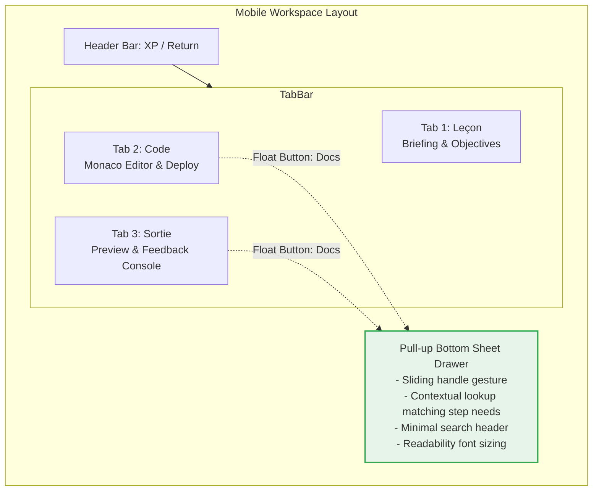
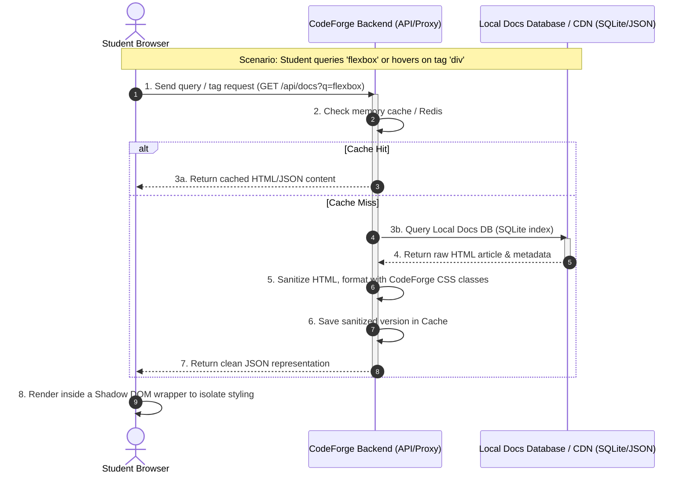

# CodeForge: Official Documentation Integration Design & Feasibility Analysis

This report presents the UX/UI designs, pedagogical strategies, and technical architecture for integrating official documentation (e.g., HTML, CSS, JavaScript) directly into the student workspace beside the Monaco code editor.

---

## Executive Summary
Integrating official documentation inside CodeForge directly addresses the student's need for inline syntax references. The optimal solution is a **Desktop 3-Column Collapsible Panel** paired with a **Local Caching/Bundling architecture**, avoiding cross-origin security blocks (CORS/CSP) while providing lightning-fast, offline-friendly access.

---

## 1. UX/UI Integration Layouts

The current student workspace utilizes `ChapterClient.tsx` (which sets up a 2-column layout on desktop and a tabbed layout on mobile) and `ChapterWorkspace.tsx` (which hosts the Monaco editor and the live preview/console output). To integrate documentation, we design two layouts optimized for screen real estate and theme preference (Mint Green/White/Grey).

### Layout 1: Desktop Collapsible Three-Panel Workspace
This layout upgrades the desktop view from 2 columns to a **3-column flexible layout**. It places the documentation on the right-hand side, allowing the student to view instructions, write code, and reference documentation simultaneously.

```mermaid
graph TD
    subgraph Desktop Workspace (3-Column Layout)
        Header[Header Bar: Logo, Navigation, XP Bar & Progress Indicator]
        Header --> MainSplit[Main Workspace Splitter]
        
        subgraph MainSplit [Main Workspace Splitter]
            Col1[Column 1: Instructions Panel 30% Width<br>- Step Header / Level Tag<br>- Mission Briefing & Narrative<br>- Interactive Objectives Checkboxes<br>- '💡 Indice' Toggle Button]
            
            Col2[Column 2: Coding Workspace 45% Width<br>- Tab Title: index.html / script.js<br>- Monaco Code Editor<br>- Run/Deploy Action Button<br>- Live Feedback / Enemy Sprite Status Bar<br>- Output Panel: HTML IFrame Preview or JS Console]
            
            Col3[Column 3: Collapsible Docs Panel 25% Width<br>- Toggle Expand/Collapse Handle<br>- Search Input Bar & Docs Filter HTML/CSS/JS<br>- Navigation Tree / Index of Elements<br>- Document Content Area: styled text with syntax highlighting]
        end
        
        Footer[Footer Bar: Step Progress Tracker, Précédent & Suivant Buttons]
        MainSplit --> Footer
    end

    style Col3 fill:#e6f4ea,stroke:#34a853,stroke-width:2px;
    style Col2 fill:#ffffff,stroke:#dadce0,stroke-width:1px;
    style Col1 fill:#f8f9fa,stroke:#dadce0,stroke-width:1px;
```

#### Key Details:
- **Collapsible Sidebar**: Column 3 can be collapsed to `50px` width (showing only a vertical search icon and label) to maximize space for coding when documentation is not needed.
- **Theme Adaptation**: The panel uses the Light Theme (Mint Green accents, clean white backgrounds, and cool grey borders). It keeps headers distinct with subtle `#e6f4ea` background colors.
- **Monaco Linkage**: Double-clicking a tag or keyword in Monaco can trigger an automatic look-up, sliding open the Docs Panel and displaying the corresponding reference.

---

### Layout 2: Mobile Tabbed Workspace with Pull-Up Drawer
On mobile devices (where space is severely limited), adding columns is not viable. Building upon the current tab selector (`Leçon`, `Code`, `Sortie`), we introduce an overlay **Documentation Drawer** accessible via a floating action button (FAB) or a gesture.



#### Key Details:
- **Bottom-Sheet Drawer**: Swiping up from the bottom of the screen or tapping the "Docs" FAB opens a half-screen sheet overlay containing the relevant reference material.
- **Gesture Control**: The student can pull the sheet to full height for reading, pull it down to half-height to refer to while editing, or dismiss it completely.
- **Layout Styling**: Clean white card overlay with rounded top corners, grey text, and mint-green highlights on code tags and links.

---

## 2. Pedagogical Integration Strategy

Integrating documentation is not just a technical feature; it is an educational tool. We apply three core pedagogical principles:

### A. Student Autonomy & Professional Practice
- **Real-world Skills**: In standard coding bootcamps, students rely heavily on Google or ChatGPT, which often write the code for them. By embedding official reference materials, CodeForge teaches students how to search, read, and interpret technical specifications (e.g. MDN structure) - a critical skill for autonomous developers.
- **Guided Exploration**: Documentation is curated. Instead of the whole internet, students search a verified local repository containing accurate syntax explanations.

### B. Avoiding Cognitive Overload (Split-Attention Effect)
- **Minimizing Context Switching**: Switching tabs to search external sites causes high cognitive friction. By maintaining the code, the exercise instructions, and the documentation in the same visual frame, the student's working memory can focus on logic rather than navigation.
- **Visual Distinction**: The documentation panel must use distinct styles (specifically the Mint Green/White/Grey theme) to clearly demarcate "instruction content" from "reference content".

### C. Contextual Scaffolding & Progressive Disclosure
- **Pre-filtering**: For early steps (e.g., Chapter 1: HTML elements), the Docs panel automatically opens to the specific tag being taught (e.g. `<h1>` or `<p>`).
- **Fading Support**: As the student progresses to intermediate levels, the documentation no longer auto-opens. The student must use the search bar or hover features to find references, gradually fading out support to build independent research habits.

---

## 3. Technical Architecture & Data Flow

To enable fast searches, clean content rendering, and robust performance, we define the following data exchange flow.

### Sequence Diagram: Documentation Request & Render Flow



---

## 4. Comparative Feasibility Analysis of Integration Options

We analyze three approaches to obtaining and rendering documentation:

| Dimension | Option 1: iFrame Direct | Option 2: API Aggregation (e.g. DevDocs.io) | Option 3: Local Caching & Bundling |
| :--- | :--- | :--- | :--- |
| **Description** | Embed official docs directly using `<iframe>` referencing external URLs. | Fetch docs dynamically from an external API and render content natively in CodeForge. | Download and index docs sets at build-time; serve static files locally. |
| **Implementation Complexity** | **Low** (Simple `<iframe src="...">`) | **Medium** (API integration, parsing JSON, rendering markup) | **Medium-High** (Ingestion script, local database search index) |
| **UX & Styling Control** | **Poor** (External site headers, ads, banners, and fonts cannot be styled) | **Excellent** (Rendered using local Tailwind classes and Mint Green theme) | **Excellent** (Total control over styles, markup, and structural layout) |
| **Performance** | **Slow** (Loads heavy external assets, tracking scripts, and stylesheets) | **Medium** (External API roundtrips; subject to external latency) | **Ultra-Fast** (Direct local static file serving or fast DB queries) |
| **Offline Capability** | **No** (Fails entirely without internet) | **No** (Fails entirely without internet) | **Yes** (100% offline-ready, suitable for closed environments) |
| **CORS & CSP Risks** | **Critical** (Blocked by `X-Frame-Options: DENY` on MDN and others) | **Low** (Handled via server-side API requests; bypasses browser CORS) | **None** (Served from the same origin as the Next.js application) |
| **Maintenance Cost** | **Zero** (External sources maintain content) | **Low** (Subject to external API changes or rate limits) | **Medium** (Periodic updates of local doc archives needed) |

### Detailed Options Breakdown:

1. **Option 1: iFrame Direct**
   - *Pros*: Extremely simple to code; zero server space required.
   - *Cons*: High security barriers. Major documentations like MDN strictly prohibit framing. Stripping headers via reverse proxy is fragile and violates terms of service.
   - *Risk*: High risk of showing blank boxes due to browser security blocking.

2. **Option 2: API Aggregation (DevDocs.io API)**
   - *Pros*: Dynamically fetches up-to-date documentation; content can be fully styled to match the CodeForge Mint Green/White/Grey theme.
   - *Cons*: Relies on third-party availability. High network requests may trigger API rate-limiting under classroom traffic loads.
   - *Risk*: Service downtime on the third-party side directly breaks the student workspace.

3. **Option 3: Local Caching & Bundling (Recommended)**
   - *Pros*: High performance; zero network dependencies; works offline. Allows filtering documentation to match only the student's curriculum level.
   - *Cons*: Initial work required to write an import script for HTML/CSS/JS reference archives. Increases total deployment/bundle size.
   - *Risk*: Keeping the documentation updated (though coding specs for HTML/CSS/JS change very slowly).

---

## 5. Architectural Recommendation

To ensure the best student experience and system reliability, we recommend **Option 3: Local Caching & Bundling** served via Next.js static routing.

### Proposed Implementation Plan:
1. **Data Ingestion**: At build-time, run a script that downloads clean MDN/DevDocs JSON archives for HTML, CSS, and JS.
2. **Database Storage**: Store these pages in a lightweight local SQLite database (or pre-rendered JSON files in the Next.js static asset folder `/public/docs/`).
3. **API Endpoint**: Expose a Next.js API route `/api/docs?course=[html|js]&q=[keyword]` which queries the local SQLite DB or fetches the static JSON.
4. **UI Integration**:
   - Install a Monaco Editor action provider: when a student hovers over an HTML tag/JS method, show a tooltip referencing the local API.
   - Render the fetched docs content inside `ChapterWorkspace` using a **Shadow DOM** component to prevent external documentation styling from breaking the CodeForge page layout.
