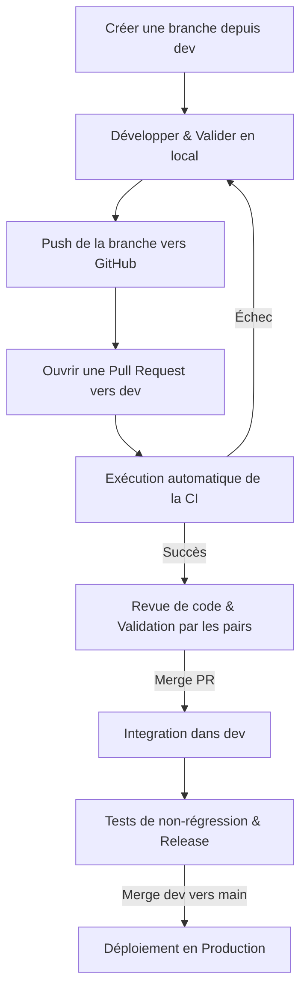

# Workflow Git & Conventions de Commit

Ce document définit la stratégie de branchement, les conventions de messages de validation (commits) et le processus de revue et de fusion (merge) appliqués au projet CodeForge.

---

## 1. Modèle de branches (Branching Model)

Nous utilisons un modèle basé sur des branches de fonctionnalités (Feature Branch Workflow) s'articulant autour de deux branches principales persistantes : `main` et `dev`.

### Branches principales
- **`main`** : Contient le code stable et prêt pour la production. Chaque fusion sur `main` correspond à une nouvelle version (release) déployée.
- **`dev`** : Branche d'intégration où sont regroupés les derniers développements validés. C'est la branche par défaut pour le développement actif.

### Branches temporaires
Toutes les nouvelles modifications doivent être isolées dans des branches dédiées créées à partir de `dev` en respectant le nommage suivant :
- **`feat/nom-fonctionnalite`** : Pour l'implémentation d'une nouvelle fonctionnalité (ex: `feat/daily-mission`).
- **`fix/nom-correctif`** : Pour la résolution d'un bug (ex: `fix/token-verification`).
- **`docs/nom-document`** : Pour la création ou la mise à jour de la documentation (ex: `docs/git-workflow`).

---

## 2. Conventions de commits (Semantic Commits)

Les messages de commit doivent suivre la spécification des **Commits Conventionnels** afin de faciliter la lecture de l'historique et l'automatisation du journal des modifications (`CHANGELOG.md`).

Le format requis est :
```
<type>(<portee>): <description en minuscule et au présent>
```

### Types autorisés
- **`feat`** : Ajout d'une nouvelle fonctionnalité.
- **`fix`** : Résolution d'un bug.
- **`docs`** : Modifications de la documentation.
- **`style`** : Changement cosmétique ou de formatage sans impact sur la logique du code (espaces, point-virgule, etc.).
- **`refactor`** : Restructuration du code sans correction de bug ni ajout de fonctionnalité.
- **`test`** : Ajout, modification ou correction de tests unitaires ou E2E.
- **`chore`** : Tâches de maintenance, mise à jour de dépendances, configuration des outils, etc.

### Portées courantes (Scopes)
La portée spécifie la partie du projet impactée par le commit. Quelques exemples :
- `auth` (authentification)
- `editor` (éditeur Monaco)
- `db` (schéma Prisma / base de données)
- `xp` (calcul de l'XP)
- `ci` (GitHub Actions workflow)
- `validators` (moteur de validation de code)

### Exemples de commits conformes
- `feat(auth): add google sign-in option`
- `fix(validators): correct regex check for html chapter 1`
- `docs(readme): update local setup guide instructions`
- `test(xp): add boundary case unit tests for level calculation`

---

## 3. Stratégie de fusion (Merging Strategy)

Afin de garantir la stabilité de la branche `dev` et de la production sur `main`, aucun développeur ne doit pousser directement de code sur les branches principales. Le processus de contribution est le suivant :



### Processus étape par étape
1. **Développement** : Le développeur effectue ses tâches sur sa branche locale (`feat/*`, `fix/*`, etc.).
2. **Pull Request (PR)** : Une fois le développement terminé et testé en local, le développeur pousse sa branche et ouvre une PR ciblant la branche `dev`.
3. **Contrôle Qualité Automatisé (CI)** : À chaque ouverture ou mise à jour de PR, le workflow de CI (`ci.yml`) s'exécute automatiquement pour lancer le linting, le typechecking, les tests unitaires (Vitest) et les tests E2E (Playwright).
4. **Revue de code** : La PR doit être revue par au moins un autre membre de l'équipe. Les tests de la CI doivent tous être au vert.
5. **Fusion dans `dev`** : Une fois approuvée, la PR est fusionnée dans `dev` (de préférence via un Squash & Merge pour conserver un historique propre).
6. **Release vers `main`** : Régulièrement, après validation globale de la branche `dev`, celle-ci est fusionnée dans `main` (via une PR dédiée) afin de déclencher le déploiement de production.
